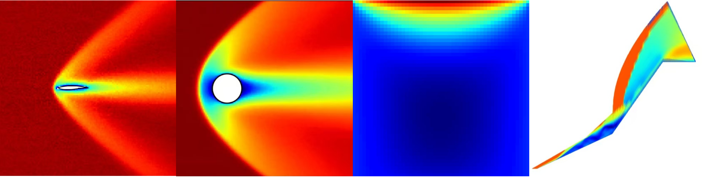

# 🚀 TransportBench: A Comprehensive Benchmark for Non-Equilibrium Gas Transport

[](https://opensource.org/licenses/GPL-2.0)
[](https://pytorch.org/)
[](#)

Welcome to the official repository for **TransportBench**. This benchmark fundamentally bridges the gap between microscopic kinetic theory and macroscopic fluid transport, providing a rigorous and physics-constrained testbed for Scientific Machine Learning (SciML) models in rarefied gas dynamics and extreme hypersonic regimes.

<p align="center">
  
</p>
<p align="center">
  <em>Ground truth macroscopic flow fields of the four physical scenarios in TransportBench.</em>
</p>

## 📂 Repository Structure

Unlike existing macroscopic continuum benchmarks, TransportBench is specifically designed to challenge neural architectures against severe multi-scale variations, non-equilibrium thermodynamic effects, and sharp shock discontinuities. The repository is modularized as follows:

- `models/`: Unified, resolution-agnostic implementations of 6 prominent topological architectures (DeepONet, FNO, U-Net, ViT, AutoEncoder, Point Transformer).
- `Task1_Airfoil/`: Geometric Generalization tracking bow shocks under complex boundary transformations.
- `Task2_Cylinder/`: Parameter Generalization ($Kn$, $Ma$) capturing unstructured wake expansions.
- `Task3_Cavity/`: The Micro-Macro Scale Bridge, predicting 10-channel high-order statistics ($\mathbf{P}$, $\mathbf{q}$) and microscopic distribution distortions.
- `Task4_DoubleCone/`: Extreme Representational Stress Test for high-frequency shock-wave discontinuities on sparse grids.

## 🛠️ Quick Start

Each task directory is fully self-contained. Navigate to any task folder to find its specific `train.py`, unified `eval.py` (with advanced plotting features), and pre-trained weights.

```bash
# Example: Evaluate Point Transformer on Task II (Cylinder Flow)
cd Task2_Cylinder
python eval.py --model pt --data_path ./data/cylinder_full_2400.pt
```

## 📊 Dataset Download

Due to GitHub's file size limits, the high-fidelity DSMC datasets (~95GB total) are hosted externally. 

* *Download links will be available upon publication.*

## 📌 Main Discoveries

Through rigorous ablation studies, TransportBench reveals that:

1. **Local Receptive Fields Triumph:** Grid-based convolutions (U-Net) absolutely dominate extreme shock-capturing tasks without spreading errors globally.
2. **The Double-Edged Sword of Fourier Features:** Explicit high-frequency injection acts as a vital cure for attention models but introduces severe non-physical noise and Gibbs oscillations in spectral/latent architectures.
3. **Micro-Macro Scale Bridge:** Operator learners (e.g., DeepONet) implicitly reconstruct high-dimensional microscopic kinetic distortions solely from macroscopic observables.

## 📝 Citation
If you find TransportBench useful in your research, please consider citing our work. *(The full citation will be updated upon publication).*

```bibtex
@article{TransportBench,
  title={TransportBench: A Comprehensive Benchmark for Non-Equilibrium Gas Transport},
  author={Wang, Xu and Li, Minghao and Xiao, Tianbai and others},
  journal={arXiv preprint (Under Review)},
  year={2026}
}

🤝 Acknowledgments
This work is supported by the Chinese Academy of Sciences and the University of Chinese Academy of Sciences. We extend our gratitude to the developers of the SPARTA DSMC solver and the open-source SciML community.
